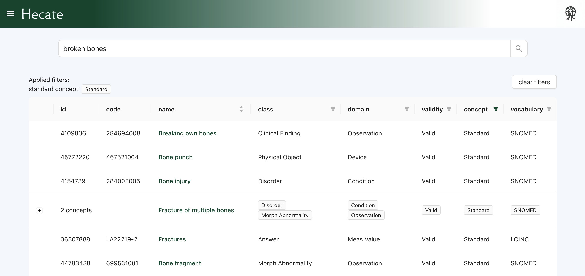

# Hecate



**Hecate is a semantic search engine for the OHDSI vocabulary**

Try it out online at [https://hecate.pantheon-hds.com](https://hecate.pantheon-hds.com)

or use the API [https://hecate.pantheon-hds.com/openapi/#/](https://hecate.pantheon-hds.com/openapi/#/)

## Overview

Hecate consists of three main components:

- **hecate-ui** - React-based frontend interface for semantic search
- **hecate-api** - Rust API backend for concept data and search
- **autocomplete** - Rust autocomplete service for search suggestions

## Used by

- [Ariadne](https://ohdsi.github.io/Ariadne/)
- [EMA Authorized Drug Mappings](https://github.com/mi-erasmusmc/ema-authorised-to-rxnorm-mappings)
- [Study Agent](https://github.com/OHDSI/StudyAgent)

## Running locally

See the [API local installation guide](./api/LOCAL_INSTALL.md) for setting up PostgreSQL, Qdrant, and the required data files. Once that's done:

```bash
# API
cd api
cargo run

# Frontend
cd ui
npm install
npm run dev

# Autocomplete
cd autocomplete
cargo run
```

## MCP Server

> **The hosted MCP server has been upgraded to Streamable HTTP. SSE transport is no longer supported. If you are having trouble connecting, please refresh your MCP client installation or update your client to a version that supports Streamable HTTP. The endpoint itself remains unchanged**

An MCP (Model Context Protocol) server is available — connect directly at `https://hecate.pantheon-hds.com/mcp/sse` see [mcp/README.md](./mcp/README.md) for more details or how to run locally.
