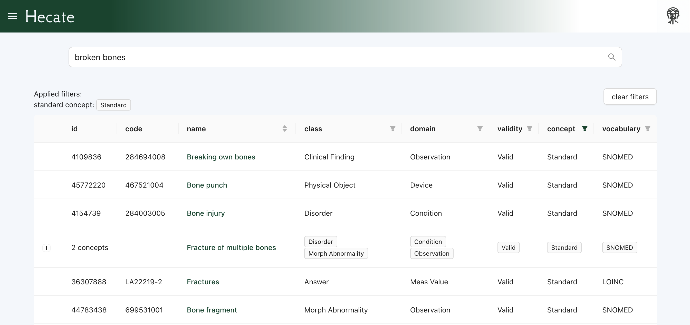

# Hecate 



**Hecate is a semantic search engine for the OHDSI vocabulary**

Try it out online at [https://hecate.pantheon-hds.com](https://hecate.pantheon-hds.com)

## Overview

Hecate consists of three main components:

- **hecate-ui** - React-based frontend interface for semantic search
- **hecate-api** - Rust API backend for concept data and search
- **autocomplete** - Rust autocomplete service for search suggestions

## Running Hecate locally

**At the moment, it requires some effort (and then some more) to get the full setup running locally.**
**There is work in progress for a fully functional friendly local install**

You need:

- A Qdrant db populated with the vector embeddings for the concepts you want to be able to find.
- Access to the model with which you generated the embeddings to fetch new embeddings for queries of unknown terms.
- For the concept details page to load, you also need a Postgres db containing the vocabulary.

If there is any interest in a basic docker compose sample setup with some limited demo data please get in touch.

## Quick Start

### Frontend (hecate-ui)
```bash
cd hecate-ui
npm install
npm run dev
```

### API Backend (hecate-api)
```bash
cd hecate-api
cargo run
```

### Autocomplete Service (autocomplete)
```bash
cd autocomplete
cargo run
```

## Tech

The application uses:
- **Frontend**: React 19 with TypeScript and Vite
- **Backend**: Rust components with Actix framework
- **Database**: PostgreSQL for vocabulary
- **Vector DB**: Qdrant for semantic search embeddings


